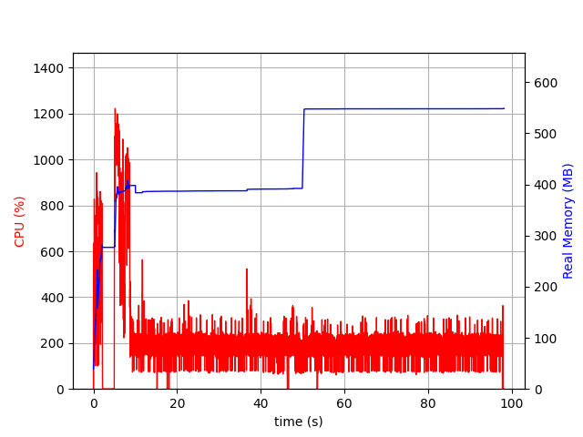
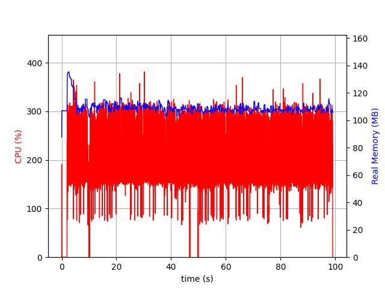
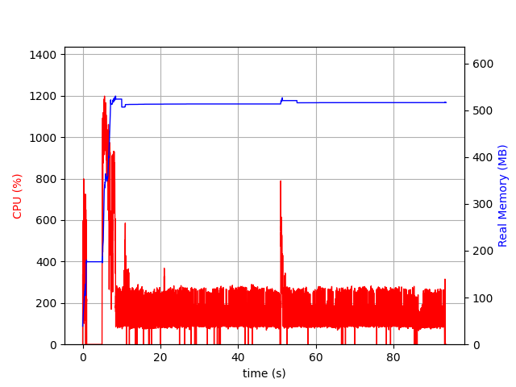
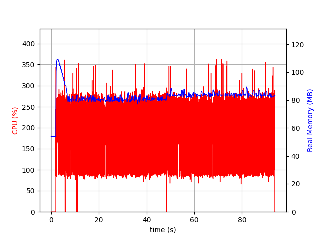
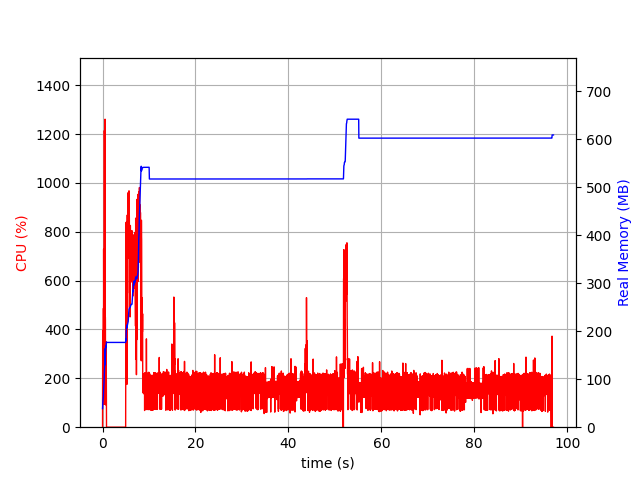
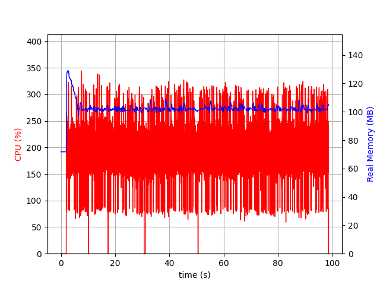
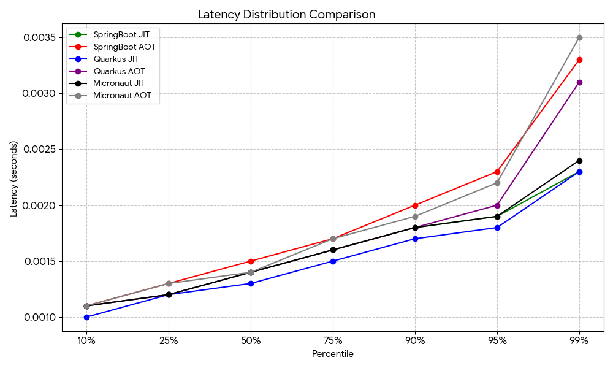

<<<
== Benchmark (no resource limit)

This is a simple comparison benchmark between the same scenario for SpringBoot, Quarkus and Micronaut, both in JIT and AOT (GraalVM) version.

The specs of the system used for the runs are

* AMD Ryzen 7 3700X 8 Core / 16 Threads
* 32 GB Memory
* Ubuntu 24 OS
* NVME disk
* MongoDB 8.2.3 running as container and already initialized

The benchmark tool used is link:https://github.com/rakyll/hey[hey] together with link:https://github.com/astrofrog/psrecord[psrecord] for plotting.

Each run is composed of 250.000 request (two times, first for warm up, second for benchmark), with 8 connections.

Each sample shows the hey command result and the psrecord plotted image.

In this scenario, no resource cap has been set

[#benchmark-no-limit-sb-jit]
=== SpringBoot JIT Benchmark

[source,txt]
----
Summary:
  Total:        44.2034 secs
  Slowest:      0.0107 secs
  Fastest:      0.0006 secs
  Average:      0.0014 secs
  Requests/sec: 5655.6790

Response time histogram:
  0.001 [1]     |
  0.002 [185744]        |■■■■■■■■■■■■■■■■■■■■■■■■■■■■■■■■■■■■■■■■
  0.003 [63096] |■■■■■■■■■■■■■■
  0.004 [828]   |
  0.005 [133]   |
  0.006 [77]    |
  0.007 [67]    |
  0.008 [12]    |
  0.009 [25]    |
  0.010 [12]    |
  0.011 [5]     |

Latency distribution:
  10% in 0.0011 secs
  25% in 0.0012 secs
  50% in 0.0014 secs
  75% in 0.0016 secs
  90% in 0.0018 secs
  95% in 0.0019 secs
  99% in 0.0023 secs

Details (average, fastest, slowest):
  DNS+dialup:   0.0000 secs, 0.0006 secs, 0.0107 secs
  DNS-lookup:   0.0000 secs, 0.0000 secs, 0.0007 secs
  req write:    0.0000 secs, 0.0000 secs, 0.0010 secs
  resp wait:    0.0014 secs, 0.0005 secs, 0.0106 secs
  resp read:    0.0000 secs, 0.0000 secs, 0.0020 secs

Status code distribution:
  [200] 250000 responses
----

[#benchmark-no-limit-sb-aot]
=== SpringBoot AOT Benchmark

[source,txt]
----
Summary:
  Total:        49.0908 secs
  Slowest:      0.0162 secs
  Fastest:      0.0007 secs
  Average:      0.0016 secs
  Requests/sec: 5092.6056

Response time histogram:
  0.001 [1]     |
  0.002 [235922]        |■■■■■■■■■■■■■■■■■■■■■■■■■■■■■■■■■■■■■■■■
  0.004 [12357] |■■
  0.005 [459]   |
  0.007 [160]   |
  0.008 [756]   |
  0.010 [236]   |
  0.012 [82]    |
  0.013 [17]    |
  0.015 [4]     |
  0.016 [6]     |

Latency distribution:
  10% in 0.0011 secs
  25% in 0.0013 secs
  50% in 0.0015 secs
  75% in 0.0017 secs
  90% in 0.0020 secs
  95% in 0.0023 secs
  99% in 0.0033 secs

Details (average, fastest, slowest):
  DNS+dialup:   0.0000 secs, 0.0007 secs, 0.0162 secs
  DNS-lookup:   0.0000 secs, 0.0000 secs, 0.0011 secs
  req write:    0.0000 secs, 0.0000 secs, 0.0017 secs
  resp wait:    0.0015 secs, 0.0006 secs, 0.0161 secs
  resp read:    0.0000 secs, 0.0000 secs, 0.0121 secs

Status code distribution:
  [200] 250000 responses
----

[#benchmark-no-limit-quarkus-jit]
=== Quarkus JIT Benchmark

[source,txt]
----
Summary:
  Total:        42.1730 secs
  Slowest:      0.0372 secs
  Fastest:      0.0006 secs
  Average:      0.0013 secs
  Requests/sec: 5927.9662

  Total data:   46000000 bytes
  Size/request: 184 bytes

Response time histogram:
  0.001 [1]     |
  0.004 [249721]        |■■■■■■■■■■■■■■■■■■■■■■■■■■■■■■■■■■■■■■■■
  0.008 [201]   |
  0.012 [28]    |
  0.015 [22]    |
  0.019 [11]    |
  0.023 [0]     |
  0.026 [8]     |
  0.030 [0]     |
  0.034 [0]     |
  0.037 [8]     |

Latency distribution:
  10% in 0.0010 secs
  25% in 0.0012 secs
  50% in 0.0013 secs
  75% in 0.0015 secs
  90% in 0.0017 secs
  95% in 0.0018 secs
  99% in 0.0023 secs

Details (average, fastest, slowest):
  DNS+dialup:   0.0000 secs, 0.0006 secs, 0.0372 secs
  DNS-lookup:   0.0000 secs, 0.0000 secs, 0.0005 secs
  req write:    0.0000 secs, 0.0000 secs, 0.0013 secs
  resp wait:    0.0013 secs, 0.0005 secs, 0.0370 secs
  resp read:    0.0000 secs, 0.0000 secs, 0.0014 secs

Status code distribution:
  [200] 250000 responses
----

[#benchmark-no-limit-quarkus-aot]
=== Quarkus AOT Benchmark

[source,txt]
----
Summary:
  Total:        45.0965 secs
  Slowest:      0.0146 secs
  Fastest:      0.0006 secs
  Average:      0.0014 secs
  Requests/sec: 5543.6629

  Total data:   46000000 bytes
  Size/request: 184 bytes

Response time histogram:
  0.001 [1]     |
  0.002 [237795]        |■■■■■■■■■■■■■■■■■■■■■■■■■■■■■■■■■■■■■■■■
  0.003 [10090] |■■
  0.005 [473]   |
  0.006 [1290]  |
  0.008 [274]   |
  0.009 [52]    |
  0.010 [17]    |
  0.012 [7]     |
  0.013 [0]     |
  0.015 [1]     |

Latency distribution:
  10% in 0.0011 secs
  25% in 0.0012 secs
  50% in 0.0014 secs
  75% in 0.0016 secs
  90% in 0.0018 secs
  95% in 0.0020 secs
  99% in 0.0031 secs

Details (average, fastest, slowest):
  DNS+dialup:   0.0000 secs, 0.0006 secs, 0.0146 secs
  DNS-lookup:   0.0000 secs, 0.0000 secs, 0.0004 secs
  req write:    0.0000 secs, 0.0000 secs, 0.0010 secs
  resp wait:    0.0014 secs, 0.0006 secs, 0.0145 secs
  resp read:    0.0000 secs, 0.0000 secs, 0.0008 secs

Status code distribution:
  [200] 250000 responses
----

[#benchmark-no-limit-micronaut-jit]
=== Micronaut JIT Benchmark

[source,txt]
----
Summary:
  Total:        44.7587 secs
  Slowest:      0.0101 secs
  Fastest:      0.0005 secs
  Average:      0.0014 secs
  Requests/sec: 5585.5066

  Total data:   46000000 bytes
  Size/request: 184 bytes

Response time histogram:
  0.001 [1]     |
  0.001 [154273]        |■■■■■■■■■■■■■■■■■■■■■■■■■■■■■■■■■■■■■■■■
  0.002 [93279] |■■■■■■■■■■■■■■■■■■■■■■■■
  0.003 [1778]  |
  0.004 [275]   |
  0.005 [156]   |
  0.006 [103]   |
  0.007 [48]    |
  0.008 [39]    |
  0.009 [33]    |
  0.010 [15]    |

Latency distribution:
  10% in 0.0011 secs
  25% in 0.0012 secs
  50% in 0.0014 secs
  75% in 0.0016 secs
  90% in 0.0018 secs
  95% in 0.0019 secs
  99% in 0.0024 secs

Details (average, fastest, slowest):
  DNS+dialup:   0.0000 secs, 0.0005 secs, 0.0101 secs
  DNS-lookup:   0.0000 secs, 0.0000 secs, 0.0005 secs
  req write:    0.0000 secs, 0.0000 secs, 0.0025 secs
  resp wait:    0.0014 secs, 0.0005 secs, 0.0101 secs
  resp read:    0.0000 secs, 0.0000 secs, 0.0016 secs

Status code distribution:
  [200] 250000 responses
----

[#benchmark-no-limit-micronaut-aot]
=== Micronaut AOT Benchmark

[source,txt]
----
Summary:
  Total:        48.0014 secs
  Slowest:      0.0126 secs
  Fastest:      0.0006 secs
  Average:      0.0015 secs
  Requests/sec: 5208.1784

  Total data:   46000000 bytes
  Size/request: 184 bytes

Response time histogram:
  0.001 [1]     |
  0.002 [207056]        |■■■■■■■■■■■■■■■■■■■■■■■■■■■■■■■■■■■■■■■■
  0.003 [38944] |■■■■■■■■
  0.004 [1949]  |
  0.005 [558]   |
  0.007 [1017]  |
  0.008 [314]   |
  0.009 [103]   |
  0.010 [41]    |
  0.011 [9]     |
  0.013 [8]     |

Latency distribution:
  10% in 0.0011 secs
  25% in 0.0013 secs
  50% in 0.0014 secs
  75% in 0.0017 secs
  90% in 0.0019 secs
  95% in 0.0022 secs
  99% in 0.0035 secs

Details (average, fastest, slowest):
  DNS+dialup:   0.0000 secs, 0.0006 secs, 0.0126 secs
  DNS-lookup:   0.0000 secs, 0.0000 secs, 0.0004 secs
  req write:    0.0000 secs, 0.0000 secs, 0.0014 secs
  resp wait:    0.0015 secs, 0.0005 secs, 0.0126 secs
  resp read:    0.0000 secs, 0.0000 secs, 0.0013 secs

Status code distribution:
  [200] 250000 responses
----

[#benchmark-no-limit-comparison]
=== Comparison

This benchmark is far from complete. With different scenarios and/or optimizations the result could be different.

This said, resource consumption and performance seems similar across the JIT runs and the AOT runs for all three Frameworks.

Quarkus seems to have a slight advantage regarding both latency and memory footprint.

NOTE: this is a specific scenario and there is no resource cap.

[cols="h,1,1,1,1,1,1", options="header"]

|===

| Latency % | SpringBoot JIT | SpringBoot AOT | Quarkus JIT | Quarkus AOT | Micronaut JIT | Micronaut AOT

| 10% | 0.0011s | 0.0011s | 0.0010s | 0.0011s | 0.0011s | 0.0011s

| 25% | 0.0012s | 0.0013s | 0.0012s | 0.0012s | 0.0012s | 0.0013s

| 50% | 0.0014s | 0.0015s | 0.0013s | 0.0014s | 0.0014s | 0.0014s

| 75% | 0.0016s | 0.0017s | 0.0015s | 0.0016s | 0.0016s | 0.0017s

| 90% | 0.0018s | 0.0020s | 0.0017s | 0.0018s | 0.0018s | 0.0019s

| 95% | 0.0019s | 0.0023s | 0.0018s | 0.0020s | 0.0019s | 0.0022s

| 99% | 0.0023s | 0.0033s | 0.0023s | 0.0031s | 0.0024s | 0.0035s

|===

.Latency Distribution Comparison (Framework Comparison)
